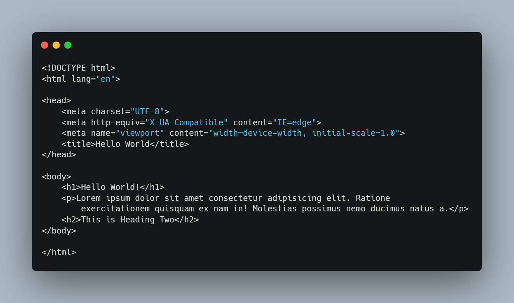
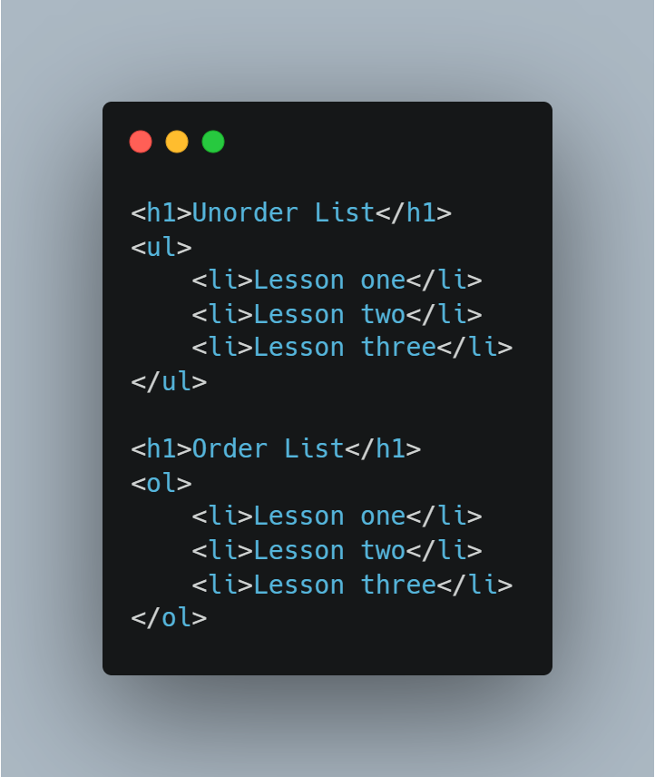

# August Host သင်ရိုးညွန်း

- [About Us](https://www.augusthost.com/about)

## Table of contents

1. [Introduction](#introduction)
2. [What is website](#what-is-website)
3. [What is HTML](#what-is-html)
   1. [Create Your First HTML file](#create-your-first-html-file)
   2. [Meta](#meta)
   3. [Bullet List](#bullet-list)

# Introduction

# What is Website

# What is HTML

HTML ဆိုတာ Hyper Text Markup Language ကိုအတိုကောက်ပြောတာဖြစ်တယ်။HTML က webpages များကို ဖန်တီးရန်အတွက် စံသတ်မှတ်ထားသော ဘာသာစကားဖြစ်တယ်။HTML မှာကအားလုံးကို elements နဲ့ဖွဲ့စည်းထားတယ်။ဘယ်လိုရေးထားတယ်ဆိုတာကို browser ကိုပြောပြထားတာဖြစ်တယ်။ဒီနေရာမှာ ခေါင်းစဉ် ရေးထားတယ်။ဒီမှာက စာပိုဒ် ၊ ဒီမှာက လင့် စသည်ဖြင့်ပြောပြတာဖြစ်တယ်။ဥပမာ-header,paragraph,etc...
နားလည်ရမှာက HTML ဆိုတာ content တွေကိုရေးတာဖြစ်ပြီး css ဆိုတာက style တွေကိုရေးတာဖြစ်တယ်။

# Create Your First HTML file

ဒီသင်ခန်းစာမှာတော့ website တစ်ခုလောက်ဆွဲရအောင်။ပထမဆုံး VS Code editor ကိုဖွင့်မယ်။Folder တစ်ခုဆောက်ပြီး index.html ဆိုတဲ့ file ဆောက်ပါ။
`<h1>Hello World!</h1>`
ကိုရေးကြည့်ပါ။

# Meta

အပေါ်ကပုံထဲက `<meta>` ဆိုတာ HTML စာမျက်နှာထဲမှာ ထည့်သွင်းလိုက်သော data အချက်အလက်များဖြစ်တယ်။`<head></head>` အတွင်းမှာရေးရပြီး ထို data ကို browser ပေါ်တွင်ပြသမည်မဟုတ်သော်လဲ search engine များကထို data ကိုအသုံးပြုပြီးရှာဖွေကြပါသည်။

# Bullet List

bullet list ဆိုတာက HTML element ထဲကနောက်ထပ် HTML element ဖြစ်တယ်။Menu ဆောက်တာတို့ List ပြတာတို့တွေမှာသုံးတယ်။

